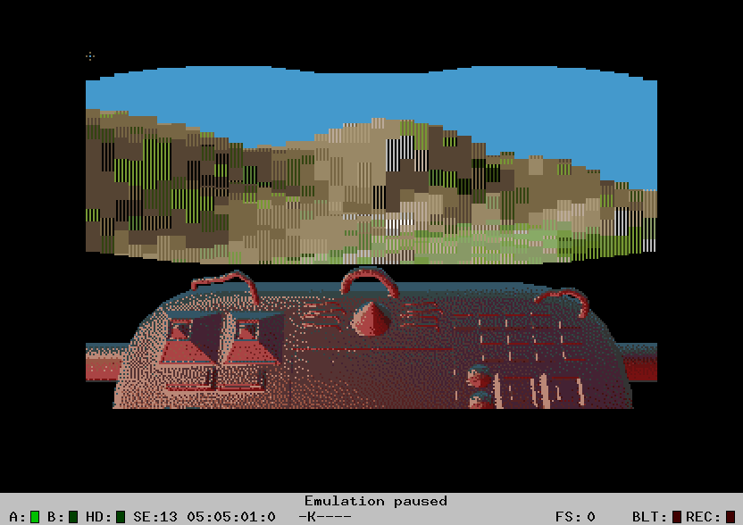

This is voxel-st, an experimental VoxelSpace engine for the Atari ST.
It runs on machines with as little as 1MB of RAM.

For convenience, I've committed binaries and (in one case) generated assembler code.

To build, have `$CC` point to `m68k-atari-mint-m68k-gcc` and enter the following command:

    make "CFLAGS=-O3" "LDFLAGS=-s"

It might be necessary to edit `Makefile` to configure the path to _libcmini_.

Have fun!
